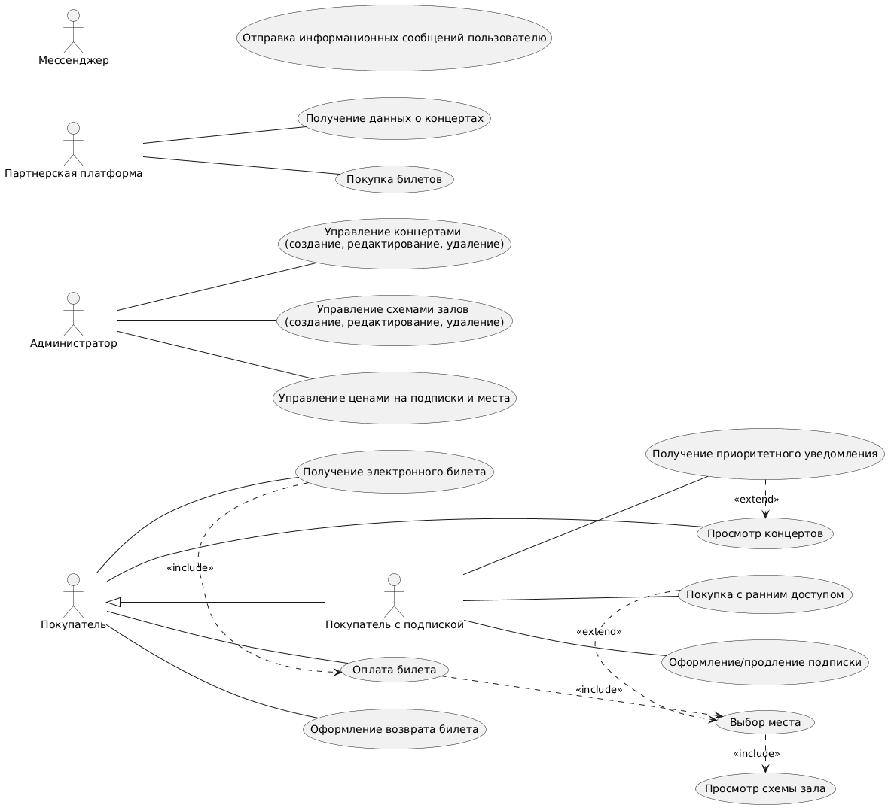

# Лабораторная работа №1
**Тема**: Формулирование требований к программной системе
**Цель работы**: Научиться анализировать поставленную задачу, формулировать функциональные и нефункциональные требования к проектируемой системе.
## Перечень заинтересованных лиц (стейкхолдеров)
  - Покупатели билетов - основные пользователи системы, просматривают, покупают и сдают билеты, могут купить подписку
  - Пользователи с подпиской - имеют приоритет при покупке билетов, получении уведомлений
  - Администраторы системы - отвечают за наполнение системы информацией о концертах
  - Организаторы концертов - поставщики концертов.
  - Онлайн-площадки продаж билетов - предоставляют канал для взаимодействия с пользователями
  - Партнерский мессенджер - предоставляет канал информирования покупателей
## Перечень функциональных требований
  1. Администратор может создавать, редактировать информацию о концертах.
  2. Администратор может управлять отображением схем залов, свободных мест, ценообразованием.
  3. Пользователь может просматривать доступные концерты.
  3. Пользователь может покупать билеты на свободные места.
  4. У пользователя не должно быть возможности купить билет на уже забронированное место.
  5. При наличии подписки пользователь получает приоритет при покупке билетов, получении уведомлений.
  6. Пользователь может вернуть билет до начала концерта.
  7. После возврата билета пользователю возвращается часть потраченных на билет денег.
  8. Площадки-партнёры должны иметь возможность получать информацию о билетах через API системы.
## Диаграмма вариантов использования

## Перечень сделанных предположений
  1. При возврате билетов пользователь получает обратно не полную стоимость билета (например, 90%)
  2. Подписка позволяет получить доступ к покупке билетов раньше обычных пользователей.
## Перечень нефункциональных требований
  1. Интегрируемость: API системы должен быть задокументирован для пользвоания партнерами 
  2. Надежность: система должна выдерживать всплески количества пользователей до 10000 человек в секунду.
  3. Удобство использования: пользователь должен понимать какие места свободны, как они расположены и какие у них цены.
