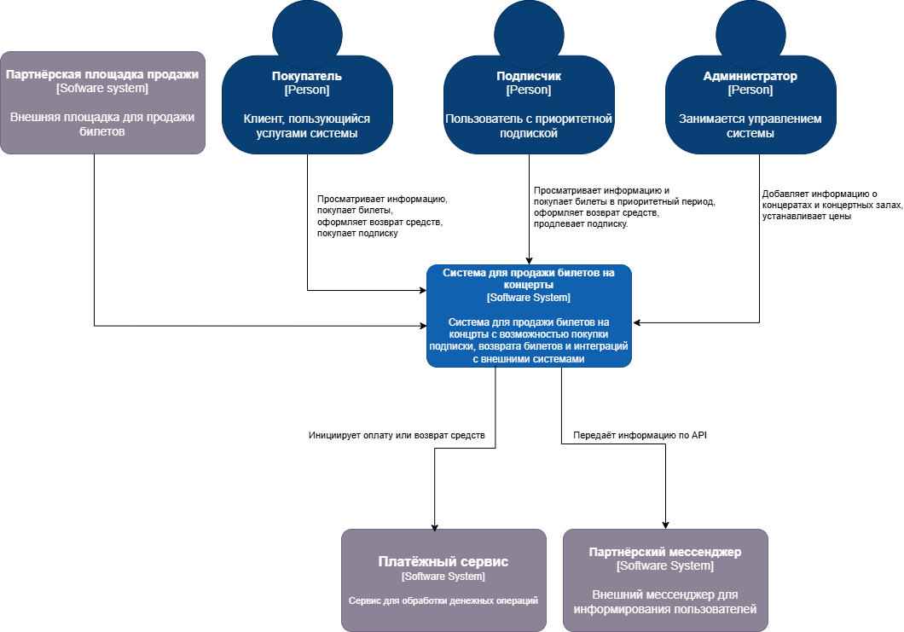
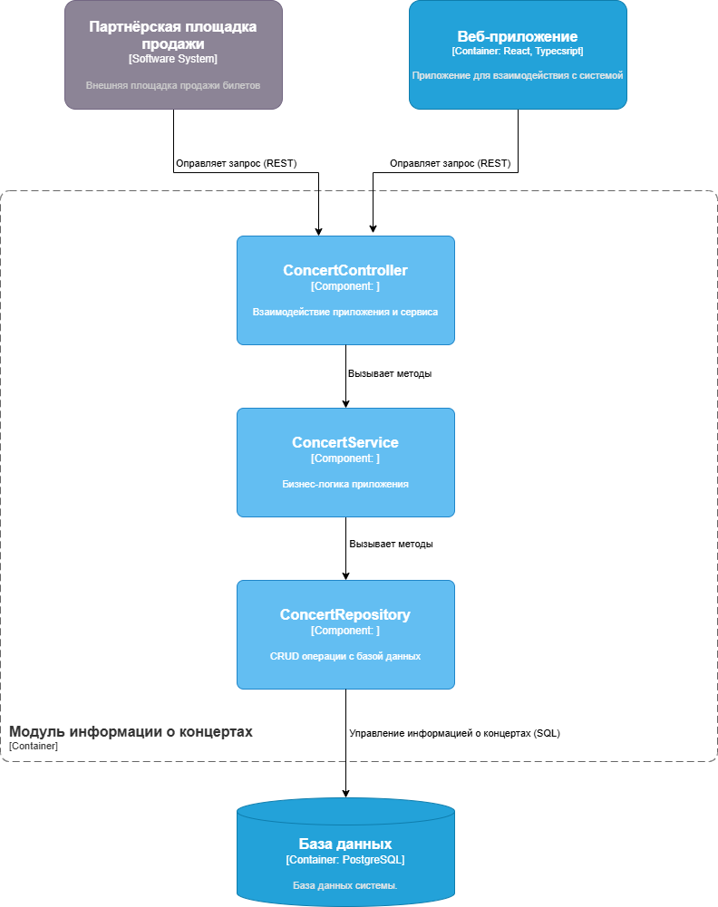
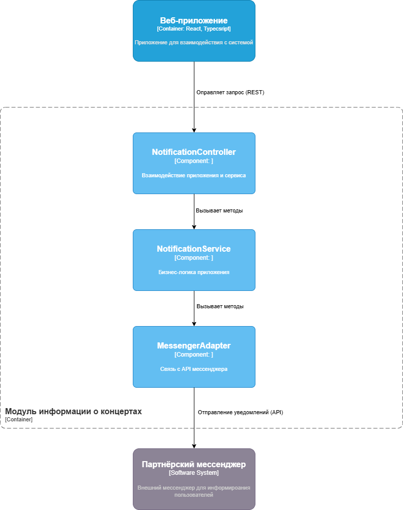

# Лабораторная работа №2
**Тема**: Использование нотации C4 model для проектирования архитектуры программной системы  
**Цель работы**: Получить опыт использования графической нотации для фиксации архитектурных решений.
## Диаграмма системного контекста
   
Покупатель, Подписчик и Администратор - основные пользователи системы  
Партнёрская площадка продажи - внешняя система, предоставляющая возможность продажи билетов  
Платёжный сервис - внешний сервис для обработки денежных операций  
Партнёрский мессенджер - внешняя система для отправления уведомлений  
## Диаграмма контейнеров
   
Выбрана микросервисная архитектура из-за возмжности независимой разработки модулей, разделения ответственности, возможности добавления в будущем новых модулей, наличия модулей развёртывания. 

Веб-приложение - приложение с которым взаимодействуют пользователи.  
Модуль оплаты - модуль для обработки запросов связанных с оплатой билетов  
Модуль информации о концертах - модуль для обработки запросов связанных с информацией о концертах (цена, дата и т.п.)  
Модуль информации о залах - модуль для обработки запросов связанных с информцаией о залах (количество, расположение)   
Модуль уведомлений - модуль обработки уведомлений  
Модуль бронирования - модуль обработки бронирования мест
База данных - хранилище данных системы
## Диаграммы компонентов
### Модуль информации о концертах
   
ConcertController — принимает входящие HTTP-запросы, определяет тип операции и вызывает соответсвующий метод сервиса.  
ConcertService — реализует бизнес-логику: валидацию входных данных, подготовку данных для сохранения или отдачи и т.п.  
ConcertRepository — отвечает за взаимодействие с базой данных: выполняет CRUD-операции с информацией о концертах.  
### Модуль уведомлений
  
NotificationController - принимает запросы от веб-приложения, содержащие информацию об уведомлении  
NotificationService - определяет текст сообщения, адресата  
MessengerAdapter - отправляет сообщение через API партнёрского мессенджера  