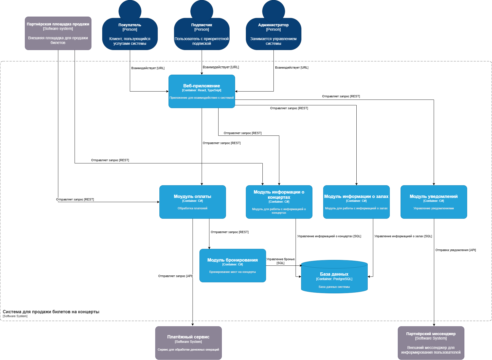
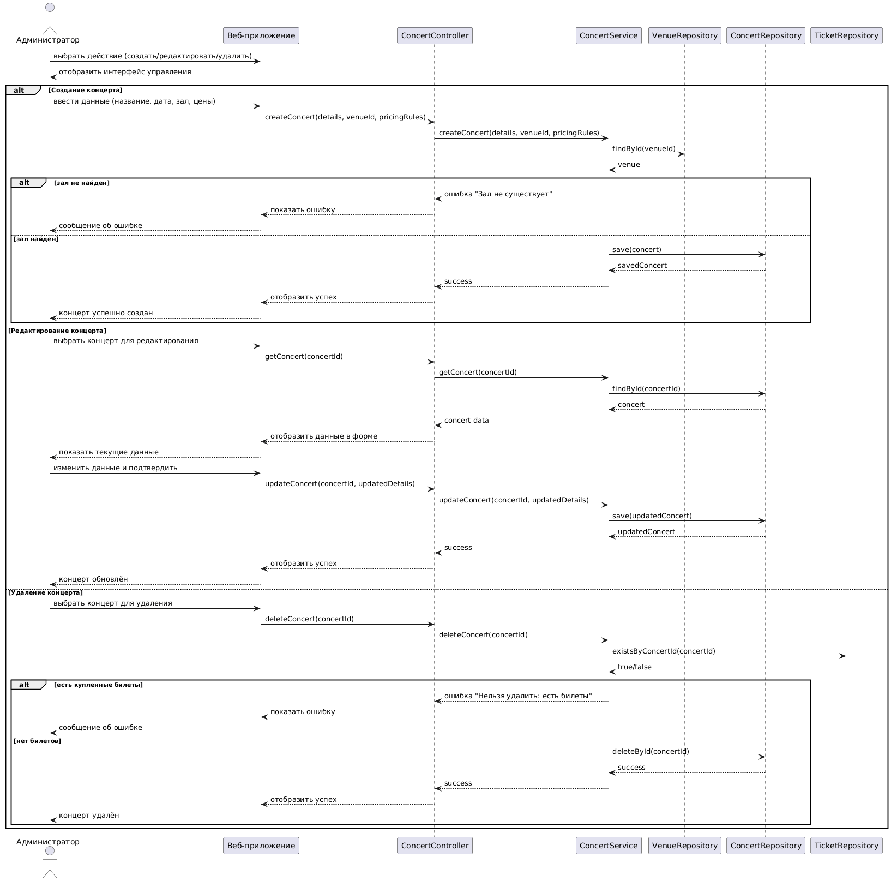
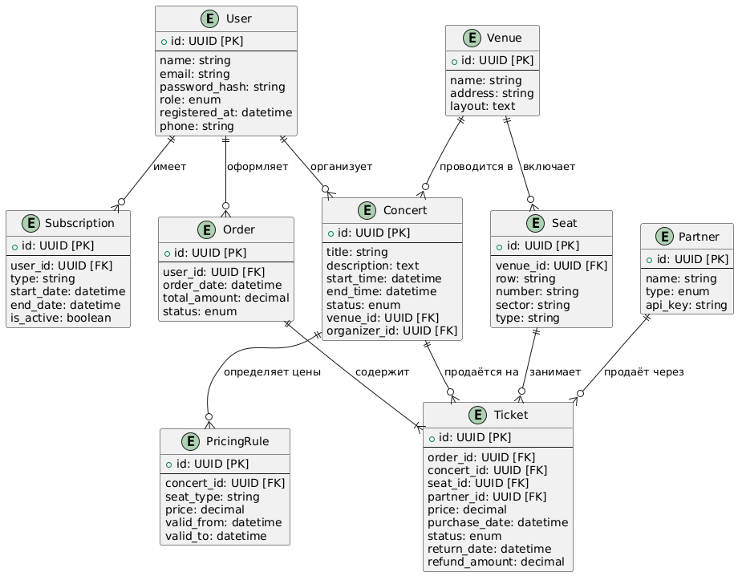

# Лабораторная работа №3
**Тема**: Использование принципов проектирования на уровне методов и классов  
**Цель работы**: Получить опыт проектирования и реализации модулей с использованием принципов KISS, YAGNI, DRY, SOLID и др.

## Диаграмма контейнеров

## Диаграмма компонента модуль информации о концертах


## Диаграмма последовательностей
  
Диаграмма последовательности для варианта использования: Управление концертами  
## Модель БД
  
User – пользователи системы (покупатели, администраторы).  
Subscription – подписки пользователей.  
Venue – залы.  
Seat – конкретные места в зале.  
Concert – концерты.  
PricingRule – цены на категории мест для конкретного концерта.  
Ticket – билеты.  
Order – заказы.  
Partner – партнёры (для API).
## Применение основных принципов разработки
### KISS
```Python
def purchase(self, user_id: int, ticket_id: int) -> Order:
    user = self._user_repo.get_by_id(user_id)
    if not user:
        raise ValueError("Пользователь не найден")

    ticket = self._ticket_repo.get_by_id(ticket_id)
    if not ticket:
        raise ValueError("Билет не найден")

    subscription = self._user_repo.get_active_subscription(user_id)
    self._check_purchase_possible(ticket, subscription)

    ticket.status = TicketStatus.SOLD
    ticket.owner_id = user_id
    self._ticket_repo.update(ticket)

    order = Order(
        id=hash((user_id, ticket_id, datetime.now())),
        user_id=user_id,
        ticket_id=ticket_id,
        total=ticket.price,
        created_at=datetime.now()
    )
    return order
```
Данный фрагмент выполняет конкретную задачу - покупку билета. Не используются сложные вложенные структуры и ветвления.
### YAGNI
```Python
class ITicketRepository(ABC):
    @abstractmethod
    def get_by_id(self, ticket_id: int) -> Optional[Ticket]:
        pass

    @abstractmethod
    def update(self, ticket: Ticket) -> None:
        pass

    @abstractmethod
    def find_available(self, concert_id: int) -> list[Ticket]:
        pass
```
В данном интерфейсе описаны три основных метода для работы с билетами.
### DRY
``` Python
def _check_purchase_possible(self, ticket: Ticket, subscription: Optional[Subscription]) -> None:
    if ticket.status == TicketStatus.SOLD:
        raise ValueError("Билет уже продан")

    if ticket.status == TicketStatus.AVAILABLE:
        return

    if ticket.status == TicketStatus.RESERVED:
        if ticket.reserved_until and ticket.reserved_until < datetime.now():
            return
        if subscription and subscription.priority_level > 0:
            return
        raise ValueError("Билет зарезервирован другим пользователем")

    raise ValueError(f"Ошибка: {ticket.status}")
```
Описан метод для проверки возможности покупки билета. Может быть использован в нескольких местах для избегания дублирования кода.
### SOLID
#### Single Responsibility
```Python
class TicketPurchaseService:
    def __init__(self, ticket_repo: ITicketRepository, user_repo: IUserRepository):
        self._ticket_repo = ticket_repo
        self._user_repo = user_repo

    def purchase(self, user_id: int, ticket_id: int) -> Order:
        user = self._user_repo.get_by_id(user_id)
        if not user:
            raise ValueError("Пользователь не найден")

        ticket = self._ticket_repo.get_by_id(ticket_id)
        if not ticket:
            raise ValueError("Билет не найден")

        subscription = self._user_repo.get_active_subscription(user_id)
        self._check_purchase_possible(ticket, subscription)

        ticket.status = TicketStatus.SOLD
        ticket.owner_id = user_id
        self._ticket_repo.update(ticket)

        order = Order(
            id=hash((user_id, ticket_id, datetime.now())),
            user_id=user_id,
            ticket_id=ticket_id,
            total=ticket.price,
            created_at=datetime.now()
        )
        return order
```
Класс отвечает за один бизнес-процесс: Покупка билетов
#### Open/Closed
```Python
class NotificationService:
    def __init__(self, user_repo: IUserRepository, sender: INotificationSender):
        self._user_repo = user_repo
        self._sender = sender
```
Класс NotificationService использует интерфейс INotificationSender. Благодаря этому можно добавлять новые способы отправки уведомлений, реализующие интерфейс, без внесения изменений в данный класс.
#### Liskov Substitution
```Python
from abc import ABC, abstractmethod

class DiscountPolicy(ABC):
    @abstractmethod
    def apply(self, price: float) -> float:
        pass

class NoDiscount(DiscountPolicy):
    def apply(self, price: float) -> float:
        return price

class PercentageDiscount(DiscountPolicy):
    def __init__(self, percent: float):
        self.percent = percent

    def apply(self, price: float) -> float:
        return price * (1 - self.percent / 100)

class TicketPriceService:
    def __init__(self, discount_policy: DiscountPolicy):
        self._discount_policy = discount_policy

    def calculate_final_price(self, base_price: float) -> float:
        return self._discount_policy.apply(base_price)
```
В классе TicketPriceService можно использовать классы NoDiscount и PercentageDiscount и в обоих случаях код будет корректно работать.
#### Interface Segregation
```Python
class ITicketRepository(ABC):
    # методы для билетов

class IUserRepository(ABC):
    # методы для пользователей
```
Методы работы с разными репозиториями выделены в разные интерфейсы, избегаются лишние зависимости между сущностями.
#### Dependency inversion
```Python
class TicketPurchaseService:
    def __init__(self, ticket_repo: ITicketRepository, user_repo: IUserRepository):
        self._ticket_repo = ticket_repo
        self._user_repo = user_repo
```
Класс TicketPurchaseService зависит от интерфейсов, а не конкретных реализаций.
### Дополнительные принципы разработки
#### BDUF
BDUF - принцип, при котором проектирование должно быть полностью завершено до начала разработки.  
В данной задаче следует **отказаться** от этого приницпа, так как разрабатываемая программа довольно большая и в процессе могут возникать новые требования или изменяться старые.
#### SoC
SoC - принцип деления программы на отдельные функциональные блоки.   
В данной задаче принцип **применяется**, так как присутствует разделение ответственности по модулям, классам.
#### MVP
MVP - принцип, при котором разрабатывается версия программы с минимальным возможным набором функций, достаточным для удовлетворения базовых потребностей заказчика.  
Данный принцип **применим**, так как в проекте подразумевается большое количество функций и благодаря MVP можно получить первую обратную связь по разрабатываемому продукту.
#### PoC
PoC - принцип создания небольшого прототипа продукта для проверки его жизнеспособности. В отличии от MVP проверяет не рыночную потребность а осуществимость.  
В данном проекте PoC **избыточен**, идея системы проста и не требует проверки работоспосбности.