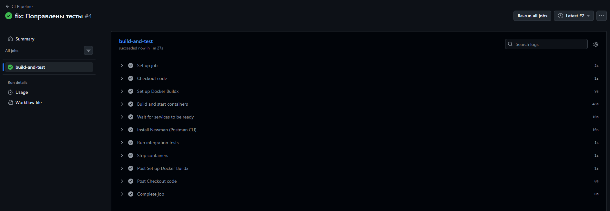
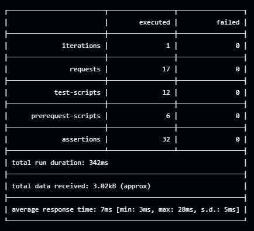

# Лабораторная работа №5
**Тема**: Реализация архитектуры на основе сервисов (микросервисной архитектуры)
**Цель работы**: Получить опыт работы организации взаимодействия сервисов с использованием контейнеров Docker

## Контейнеры
Клиентская часть - пользовательский интерфейс  
Серверная часть - API для обработки запросов, связь клиентской части с базой данных  
База данных - PostgreSQL для хранения данных

## Docker
1. Dockerfile.frontend
```dockerfile
FROM nginx:alpine
COPY index.html /usr/share/nginx/html/index.html
COPY nginx.conf /etc/nginx/conf.d/default.conf
```
2. Dockerfile.backend
```dockerfile
FROM python:3.11-slim

RUN apt-get update && apt-get install -y \
    gcc \
    libpq-dev \
    python3-dev \
    && rm -rf /var/lib/apt/lists/*

WORKDIR /app
COPY requirements.txt .
RUN pip install --no-cache-dir -r requirements.txt
COPY . .

ENV DATABASE_URL=postgresql://user:pass@db:5432/ticketdb
EXPOSE 5000
CMD ["python", "app.py"]
```
3. docker-compose
```yml
services:
  db:
    image: postgres:15
    container_name: ticket-db
    environment:
      POSTGRES_USER: user
      POSTGRES_PASSWORD: pass
      POSTGRES_DB: ticketdb
    volumes:
      - ./init.sql:/docker-entrypoint-initdb.d/init.sql
      - postgres_data:/var/lib/postgresql/data
    ports:
      - "5432:5432"
    healthcheck:
      test: ["CMD-SHELL", "pg_isready -U user -d ticketdb"]
      interval: 5s
      timeout: 5s
      retries: 5

  backend:
    build:
      context: ./backend
      dockerfile: Dockerfile.backend
    container_name: ticket-backend
    environment:
      DATABASE_URL: postgresql://user:pass@db:5432/ticketdb
    depends_on:
      db:
        condition: service_healthy
    ports:
      - "5000:5000"

  frontend:
    build:
      context: ./frontend
      dockerfile: Dockerfile.frontend
    container_name: ticket-frontend
    ports:
      - "8080:80"
    depends_on:
      - backend

volumes:
  postgres_data:
```
## CI 
```yml
name: CI Pipeline

on:
  push:
    branches: [ lab5, main ]
  pull_request:
    branches: [ lab5, main ]

jobs:
  build-and-test:
    runs-on: ubuntu-latest

    steps:
      - name: Checkout code
        uses: actions/checkout@v3

      - name: Set up Docker Buildx
        uses: docker/setup-buildx-action@v2

      - name: Build and start containers
        run: docker compose up -d --build

      - name: Wait for services to be ready
        run: |
          sleep 10
          docker compose ps

      - name: Install Newman (Postman CLI)
        run: npm install -g newman

      - name: Run integration tests
        run: |
          newman run tests/postman.json \
            --env-var "base_url=http://localhost:8080/api/v1" \
            --reporters cli,json --reporter-json-export test-results.json

      - name: Stop containers
        if: always()
        run: docker compose down
```

